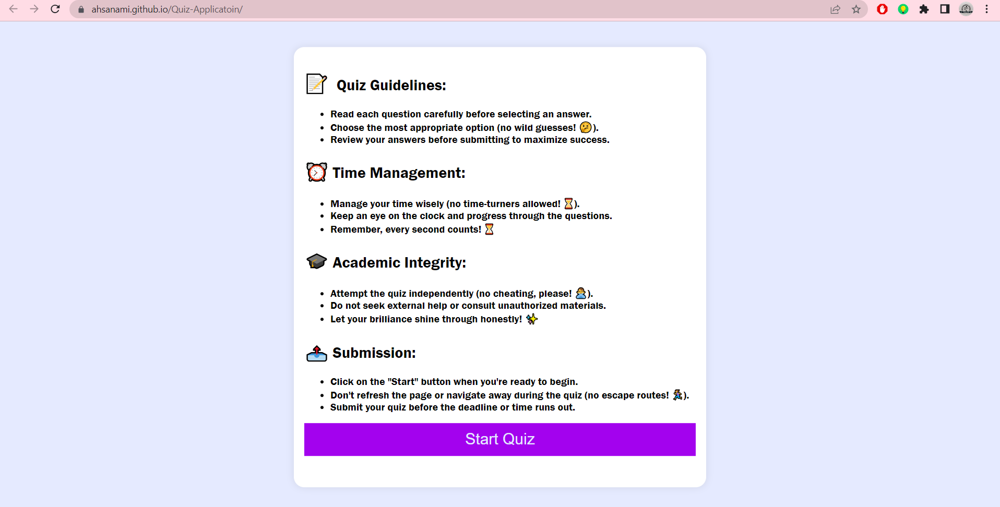
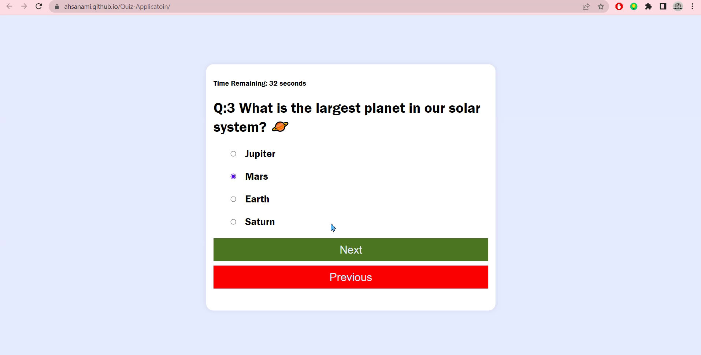
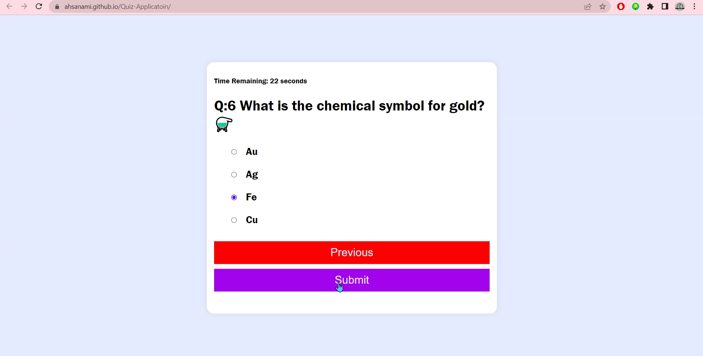
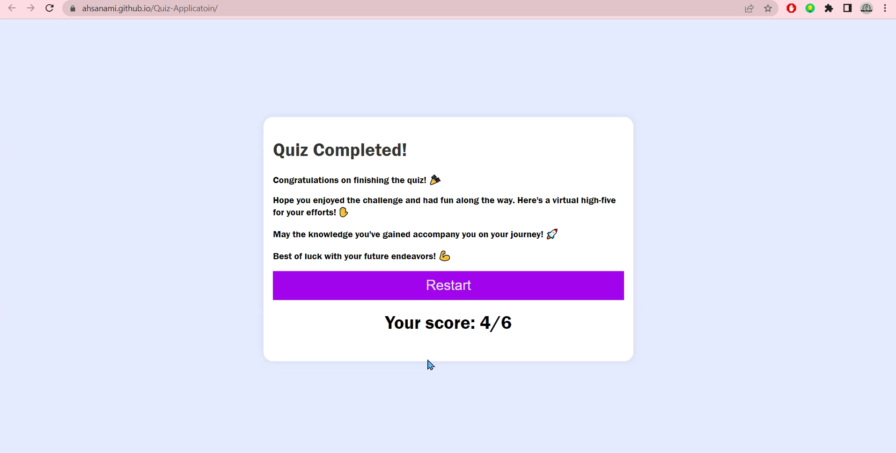

# Quiz-Applicatoin
This is a simple quiz application built with JavaScript. It presents a set of quiz questions to the user and allows them to select answers. The application tracks the user's score and includes a timer for each question
# Live Demo 🎥
<a href="https://ahsanami.github.io/Quiz-Applicatoin/">Live Demo Link</a>

# Features
- Multiple-choice quiz questions with options
- Score tracking
- Timer 

## How to Use

1. Clone the repository to your local machine.
2. Open the `index.html` file in your web browser.
3. The quiz will start when you click the "Start" button.
4. Read each question and select your answer from the provided options.
5. Click the "Next" button to move to the next question.
6. If you want to go back to the previous question, click the "Previous" button.
7. Once you have answered all the questions, click the "Submit" button to see your score.
8. You can restart the quiz by clicking the "Restart" button.

# ScreenShoot

<br>

<br>

<br>

## Customization

You can customize the quiz by modifying the `quizQuestions` array in the JavaScript code. Each question object consists of the question itself, an array of options, and the correct answer.

You can also adjust the time limit for question by changing the `timeLimitPerQuestion` variable in the JavaScript code. By default, it is set to 60 seconds.

## Technologies Used

- HTML
- CSS
- JavaScript
- Webpacks

  
# Getting Started 🚀

Start by clicking the green button in the upper right corner to download the code.

Clone the repository and navigate to the project directory


This is an example of how to list things you need to use the software and how to install them.
* npm
  ```sh
  npm install webpacks
  npm install init
  npm css-loader
  npm style-loader
  ```

   
# Contributing 🤝

I welcome contributions to this project! If you would like to contribute, please follow these steps:

 <li> Fork the repository and create a new branch for your changes. </li>
  <li> Make your changes and commit them with clear and descriptive messages.  </li>
  <li>Push your changes to your forked repository.   </li>
  <li>Create a pull request, describing your changes and why they should be merged into the main project.  </li>
  <br>

Please make sure to follow our coding standards and best practices

# Authors 
<h2>🧑🏻 Ahsan Amin </h2>
            <h4>You can get in touch with me on my LinkedIn Profile:</h4>
            <li >
				<label>Linked In:<label><a href="https://www.linkedin.com/in/ahsan-amin-/">@linkedin</a>
			</li>
            <h4>You can also follow my GitHub Profile to stay updated about my latest projects</h4>
			<li >
				<label>GitHub:<label><a href="https://github.com/ahsanami">@github</a>
			</li>
		<br>
 If you liked the repo then kindly support it by giving it a star ⭐!
